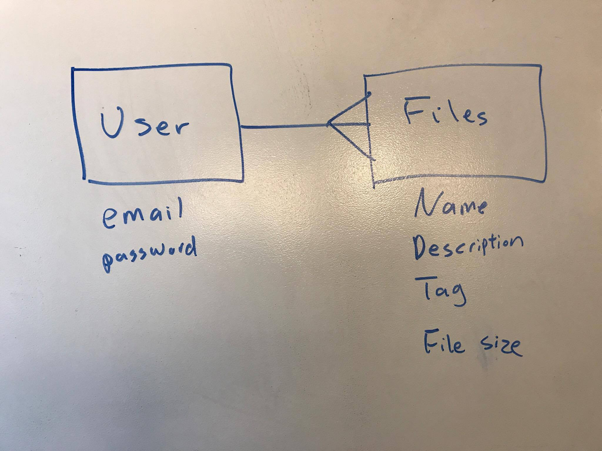

## Table of Contents

-  Description of Application.
-  Collaborators
-  Link to Deployed Front End Application
-  Link to Back End Repository
-  Techonology Used
-  Installation instructions for dependencies.
-  Approach to Project
-  User Stories
-  ERD
-  Wireframes
-  Unsolved Problems
-  Major Hurdles

## Description of Application.

This application lets you upload your files to the Internet. You can give each file
a description and also give each file a tag. This application will track when you
uploaded the files, and when you edited the files. You can browse to see files
other people have uploaded.

## Collaborators

-  Kailin Chen
-  Jeff Culbertson
-  Corey Fedde
-  Andrew Zinck

## Link to Deployed Front End Application

URL: https://the-sleeping-samurais.github.io/sleeping-samurai-1-frontend/

## Link to Back End Repository

URL: https://github.com/The-Sleeping-Samurais/sleeping-samurai-back

## Techonology Used Front End

-  HTML/CSS
-  BootStrap
-  MultiForm
-  JavaScript
-  jQuery
-  Handlebars.js
-  Node.js
-  Data Tables
-  MongoDB
-  Mongoose
-  Express

## Installation instructions for dependencies.

npm install

## Approach to Project

The first thing we did was to plan what needed to be done. We figured out how our
data would look like. A User would own multiple files, but a file is only owned
by a single user. Then we worked on the wireframe. It was a basic wireframe that
gave us some idea of how our website would look like. We decided after we got
our website functional, we would revisit the wireframe and make improvements.
Then we listed the features we needed in the front end and listed the things we
needed to do on the backend to support our front end.

We thought the best way to work was to do pair coding. There would be one team
on the front end and one team on the back end. When a pair finished a feature,
the pair would comment their code. One person from each pair would rotate. The
person staying would bring the new person up to speed.

At the start of each day we would have a 15 minute stand up meeting. Here we would
talk about what each person did the day before and will tackle today. At the end,
of the day, we would have another 15 minute stand up meeting to recap what we
did that day. We would also talk about what we would tackle the following day.

## User Stories

1. As a user, I want to be able to upload files.
2. As a user, I want to see the files I uploaded.
3. As a user, I want to edit my own files.
4. As a user, I want to delete my files.
5. As a user, I want to download my files.
6. As a user, I want to add tags and descriptions to my files.
7. As a user, I want to edit my files' tags and descriptions.
8. As a user, I want to see other people's files.
9. As a user, I want to view other people's files.
10. As a user, I want to download other people's files.
11. As a user, I want to sign up for an account
12. As a user, I want to sign in.
13. As a user, I want to change my password.
14. As a user, I want to log out.

## ERD

## Wireframes

Landing Page: https://wireframe.cc/Hz7qLa

Inner Page: https://wireframe.cc/JXEUoU

## Major Hurdles

-  We ran into a problem when we were updating an upload's information. The
   issue was that our data was not formatted correctly for ab AJAX request update.
   We posted the issue here. https://github.com/ga-wdi-boston/team-project/issues/378

-  When we created an upload, we were getting back a link to download the file,
   we uploaded. We wanted to get back a link that leads a user to the site where
   the file was hosted. We found that a team had this problem and posted an issue.
   We used their issue helpful and solved the problem. You can find further information
   here. https://github.com/ga-wdi-boston/team-project/issues/378

## Unsolved Problems

- Use a public bucket for AWS instead of using Andrew's bucket.
